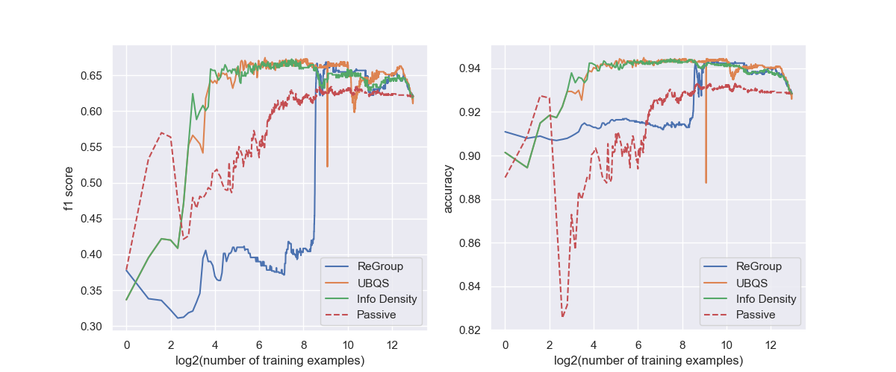

# Active Learning

- The key idea behind active learning is that a machine learning algorithm can achieve greater accuracy with fewer training labels if it is allowed to choose (typically in interative learning settings) the data from which it learns.

- An active learner may pose queries, usually in the form of unlabeled data instances to be labeled by an oracle (e.g., a human annotator).

- In active learning literature, typically, the `optimal query` ($x^*$) is the 'best' instance to be labelled to acheive highest increase in accuracy. There are different strategies to determine this best query and we will implement 2 of them in this repo.
- Additionally, we will also implement the ReGroup paper - which uses interactive online learning to create on demand group for social networks. 

---

### Implementation 
- We shall adopt sci-kit learn API for this implementation. Since we are working with interactive training, we will use sci-kit learn's naive bayes classifier which supports incremental learning using `partial_fit` method.
- However, user is allowed to switch and use any estimator that supports `partial_fit` method. List available [here](https://scikit-learn.org/0.15/modules/scaling_strategies.html#incremental-learning).

--- 

### Query Strategy Frameworks

#### Query Strategy 1: ReGroup

$x^* :=$ highest probability case with positive true class as picked up by user (oracle) interactively

Caveat: Unlearnable Groups - instances' probability are discounted based on how many times they are skipped (not picked up by human).

$$P(g \mid x)=P(g \mid x) * v^n$$

where,
$n =$ number of times instance is skipped (or not picked) and

$v =$ unlearnable_group_discount_factor

---

#### Query Strategy 2: Uncertainity Based Query Sampling (UBQS)

$x^* :=$ instance which the algorithm is least confident about OR is most likely to mislabel

In binary classification tasks, UBQS (**where uncertainty is defined by entropy**) simply queries the instance whose posterior probability of being positive is nearest 0.5

---

#### Query Strategy 3: Information Density

- In UBQS, we pick the query instance model is MOST uncertain about (where uncertainty is defined by entropy).

- In practice, this startegy is prone to querying outliers.

- The main idea is that informative instances should not only be those which are uncertain, but also those which are “representative” of the underlying distribution (i.e., inhabit dense regions of the input space).

$$
x_{I D}^*=\underset{x}{\operatorname{argmax}} \phi_A(x) \times\left(\frac{1}{U} \sum_{u=1}^U \operatorname{sim}\left(x, x^{(u)}\right)\right)^\beta .
$$

where 
- $\phi_A(x)$ represents the informativeness of x according to some “base” query strategy A - which is UBQS in our implementation, 
- Term on the right is average similarity average similarity to all other (other than x) instances. 
- For our implementation, we use 
- Parameter $\beta$ is controls the relative importance of the density term

---

### Performance Analysis

### References 
Burr Settles. Active Learning Literature Survey. Computer Sciences Tech-
nical Report 1648, University of Wisconsin–Madison. 2009.

Amershi, Saleema, James Fogarty, and Daniel Weld. "Regroup: Interactive machine learning for on-demand group creation in social networks." Proceedings of the SIGCHI conference on human factors in computing systems. 2012.
